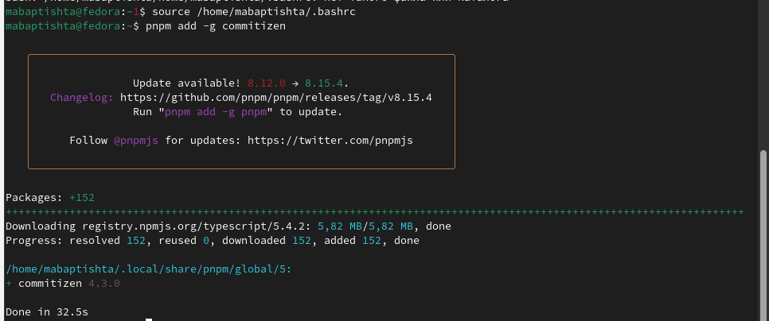
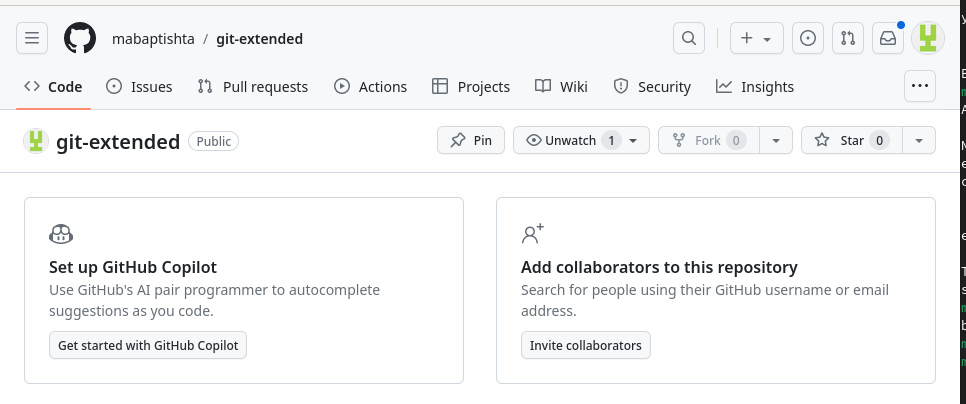
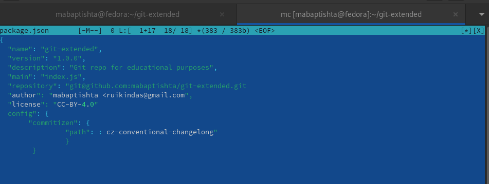

---
## Front matter
title: "Лабораторная работы №3. "
subtitle: "Лабораторная работа Продвинутое использование git."
author: "Баптишта Матеуж Андре" 

## Generic otions
lang: ru-RU
toc-title: "Содержание"

## Bibliography
bibliography: bib/cite.bib
csl: pandoc/csl/gost-r-7-0-5-2008-numeric.csl

## Pdf output format
toc: true # Table of contents
toc-depth: 2
lof: true # List of figures
lot: true # List of tables
fontsize: 12pt
linestretch: 1.5
papersize: a4
documentclass: scrreprt
## I18n polyglossia
polyglossia-lang:
  name: russian
  options:
	- spelling=modern
	- babelshorthands=true
polyglossia-otherlangs:
  name: english
## I18n babel
babel-lang: russian
babel-otherlangs: english
## Fonts
mainfont: PT Serif
romanfont: PT Serif
sansfont: PT Sans
monofont: PT Mono
mainfontoptions: Ligatures=TeX
romanfontoptions: Ligatures=TeX
sansfontoptions: Ligatures=TeX,Scale=MatchLowercase
monofontoptions: Scale=MatchLowercase,Scale=0.9
## Biblatex
biblatex: true
biblio-style: "gost-numeric"
biblatexoptions:
  - parentracker=true
  - backend=biber
  - hyperref=auto
  - language=auto
  - autolang=other*
  - citestyle=gost-numeric
## Pandoc-crossref LaTeX customization
figureTitle: "Рис."
tableTitle: "Таблица"
listingTitle: "Листинг"
lofTitle: "Список иллюстраций"
lotTitle: "Список таблиц"
lolTitle: "Листинги"
## Misc options
indent: true
header-includes:
  - \usepackage{indentfirst}
  - \usepackage{float} # keep figures where there are in the text
  - \floatplacement{figure}{H} # keep figures where there are in the text
---

# Цель работы
Получение навыков правильной работы с репозиториями git.

# Задание

Выполнить работу для тестового репозитория.
Преобразовать рабочий репозиторий в репозиторий с git-flow и conventional commits.

# Теоретическое введение

Рабочий процесс Gitflow Workflow. Будем описывать его с использованием пакета git-flow.
                                                                                                       |

Более подробно про Unix см. в [@tanenbaum_book_modern-os_ru; @robbins_book_bash_en; @zarrelli_book_mastering-bash_en; @newham_book_learning-bash_en].

# Выполнение лабораторной работы

№1
Установка git-flow.(рис. [-@fig:001])

{ #fig:001 width=70% } 

Поменяли цель, теоретическое введение и задания на нужные. (рис. [-@fig:002])

{ #fig:002 width=70% } 

№2
Установка Node.js (рис. [-@fig:003])

{ #fig:003 width=70% } 

№3
apt-get install pnpm. (рис. [-@fig:004])

{ #fig:004 width=70% } 

pnpm add -g commitizen. (рис. [-@fig:005])

{ #fig:005 width=70% } 

pnpm add -g standard-changelog. (рис. [-@fig:006])

{ #fig:006 width=70% }

pnpm add -g standard-changelog. (рис. [-@fig:007)

{ #fig:007 width=70% }

Создание репозитория git. (рис. [-@fig:008)

{ #fig:008 width=70% }

Делаем первый коммит и выкладываем на github: (рис. [-@fig:009)

{ #fig:009 width=70% }

Конфигурация общепринятых коммитов: (рис. [-@fig:0010)

{ #fig:0010 widt70% }

Необходимо заполнить несколько параметров пакета.: (рис. [-@fig:0011)

{ #fig:011 width=70% }

# Выводы

В процессе выполнения этой лабораторной работы я научилась работать с языком разметки git-flow. Познакомилась с базовым синтаксисом git-flow.

# Список литературы{.unnumbered}

::: {#refs}
:::
