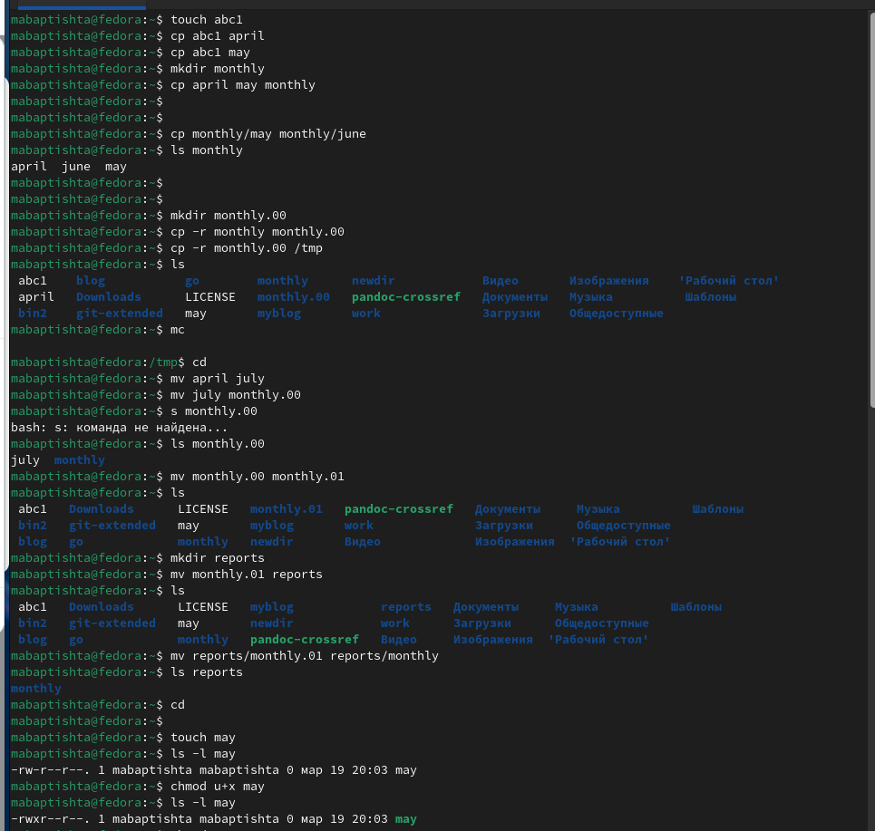
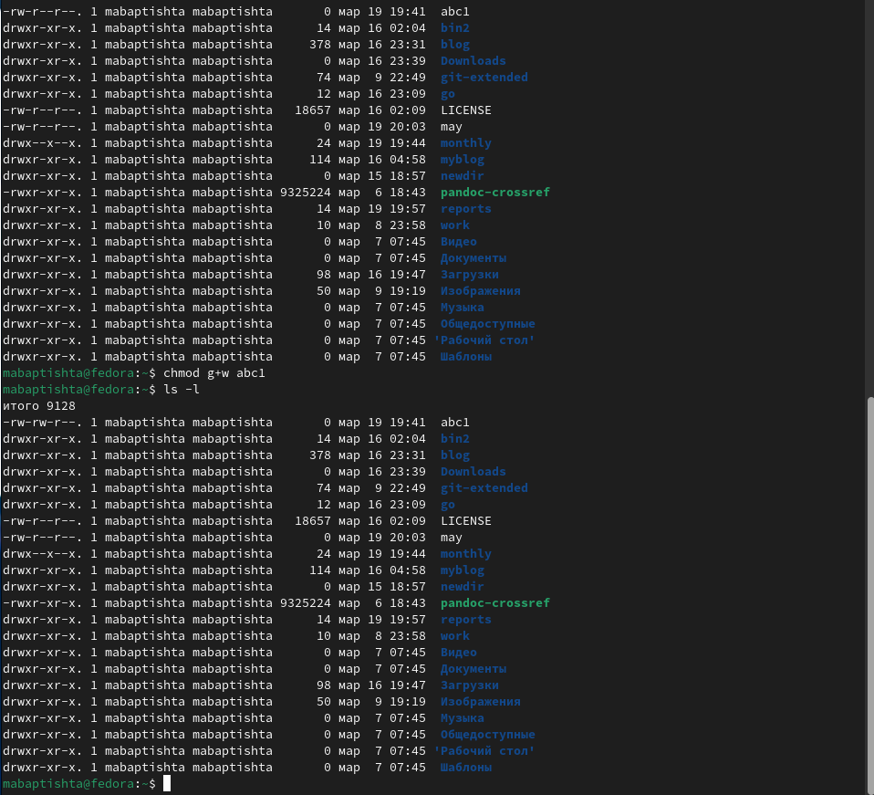
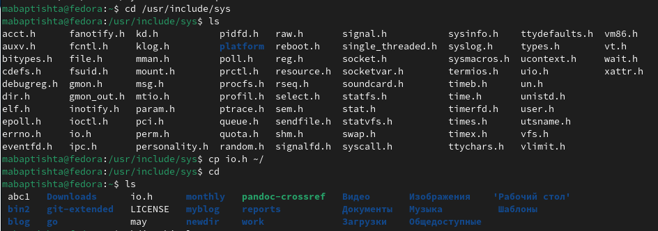
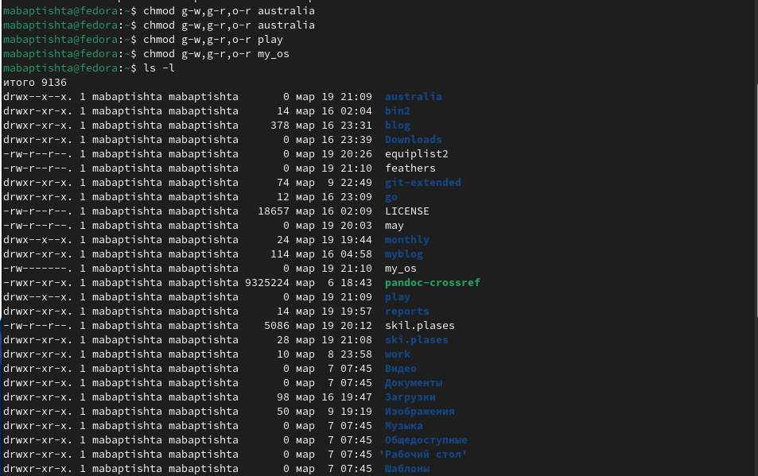
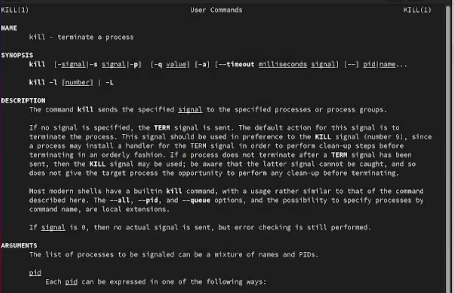
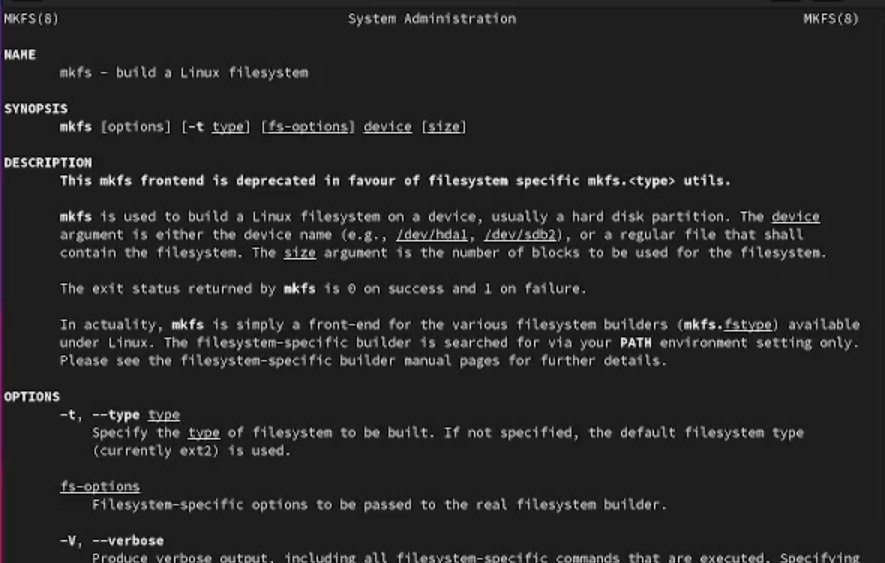
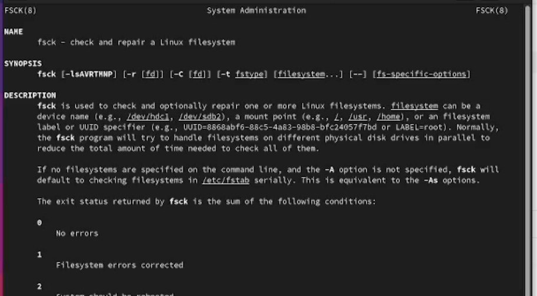
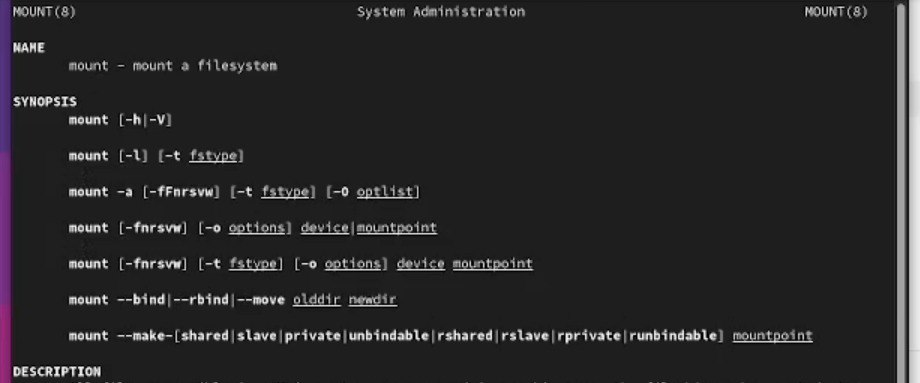

---
## Front matter
title: "Шаблон отчёта по лабораторной работе №5"
subtitle: "Анализ файловой системы Linux Команды для работы с файлами и каталогами"
author: "Баптишта Матеуж Андре"

## i18n babel
babel-lang: russian
babel-otherlangs: english

## Formatting pdf
toc: false
toc-title: Содержание
slide_level: 2
aspectratio: 169
section-titles: true
theme: metropolis
header-includes:
 - \metroset{progressbar=frametitle,sectionpage=progressbar,numbering=fraction}
 - '\makeatletter'
 - '\beamer@ignorenonframefalse'
 - '\makeatother'
---

## Цель работы
Ознакомление с файловой системой Linux, её структурой, именами и содержанием
каталогов. Приобретение практических навыков по применению команд для работы
с файлами и каталогами, по управлению процессами (и работами), по проверке использования диска и обслуживанию файловой системы.

## Задание

1. Выполните все примеры, приведённые в первой части описания лабораторной работы.
2. Выполните следующие действия, зафиксировав в отчёте по лабораторной работе
используемые при этом команды и результаты их выполнения:
2.1. Скопируйте файл /usr/include/sys/io.h в домашний каталог и назовите его
equipment. Если файла io.h нет, то используйте любой другой файл в каталоге
/usr/include/sys/ вместо него.
2.2. В домашнем каталоге создайте директорию ~/ski.plases.
2.3. Переместите файл equipment в каталог ~/ski.plases.
2.4. Переименуйте файл ~/ski.plases/equipment в ~/ski.plases/equiplist.
2.5. Создайте в домашнем каталоге файл abc1 и скопируйте его в каталог
~/ski.plases, назовите его equiplist2.
2.6. Создайте каталог с именем equipment в каталоге ~/ski.plases.
2.7. Переместите файлы ~/ski.plases/equiplist и equiplist2 в каталог
~/ski.plases/equipment.
2.8. Создайте и переместите каталог ~/newdir в каталог ~/ski.plases и назовите
его plans.

## Задание
3. Определите опции команды chmod, необходимые для того, чтобы присвоить перечисленным ниже файлам выделенные права доступа, считая, что в начале таких прав
нет:
3.1. drwxr--r-- ... australia
3.2. drwx--x--x ... play
3.3. -r-xr--r-- ... my_os
3.4. -rw-rw-r-- ... feathers
При необходимости создайте нужные файлы.

## Задание
4. Проделайте приведённые ниже упражнения, записывая в отчёт по лабораторной
работе используемые при этом команды:
4.1. Просмотрите содержимое файла /etc/password.
4.2. Скопируйте файл ~/feathers в файл ~/file.old.
4.3. Переместите файл ~/file.old в каталог ~/play.
4.4. Скопируйте каталог ~/play в каталог ~/fun.
4.5. Переместите каталог ~/fun в каталог ~/play и назовите его games.
4.6. Лишите владельца файла ~/feathers права на чтение.
4.7. Что произойдёт, если вы попытаетесь просмотреть файл ~/feathers командой
cat?
4.8. Что произойдёт, если вы попытаетесь скопировать файл ~/feathers?
4.9. Дайте владельцу файла ~/feathers право на чтение.
4.10. Лишите владельца каталога ~/play права на выполнение.
4.11. Перейдите в каталог ~/play. Что произошло?
4.12. Дайте владельцу каталога ~/play право на выполнение.
5. Прочитайте man по командам mount, fsck, mkfs, kill и кратко их охарактеризуйте,
приведя примеры.

## Теоретическое введение

Файловая система (ФС) — архитектура хранения данных, которые могут находиться в разделах жесткого диска и ОП. Выдает пользователю доступ к конфигурации ядра. Определяет, какую структуру принимают файлы в каждом из разделов, создает правила для их генерации, а также управляет файлами в соответствии с особенностями каждой конкретной ФС [@Struct:bash] . Основные файловые системы, используемые в дистрибутивах Linux: Ext2; Ext3; Ext4; JFS; ReiserFS; XFS; Btrfs; ZFS. Ext2, Ext3, Ext4 или Extended Filesystem – стандартная файловая система, первоначально разработанная еще для Minix [@File:bash].

## Выполнение лабораторной работы

1.  Выполним все примеры, приведённые в первой части описания лабораторной работы. (рис. @fig:001 ;@fig:002 ;@fig:003).

{#fig:001 width=70%}

{#fig:002 width=70%}

{#fig:003 width=70%}

## Выполнение лабораторной работы
2.  Выполним следующие действия, зафиксировав в отчёте по лабораторной работе используемые при этом команды и результаты их выполнения: 2.1. Скопируйте файл /usr/include/sys/io.h в домашний каталог и назовите его equipment. Если файла io.h нет, то используйте любой другой файл в каталоге /usr/include/sys/ вместо него.(рис. @fig:004)

{#fig:004 width=70%}

2.2. В домашнем каталоге создадим директорию ~/ski.plases. 2.3. Переместим файл equipment в каталог ~/ski.plases. 2.4. Переименуем файл ~/ski.plases/equipment в ~/ski.plases/equiplist.(рис. @fig:005)

{#fig:005 width=70%}

2.5. Создадим в домашнем каталоге файл abc1 и скопируйте его в каталог ~/ski.plases, назовите его equiplist2. 2.6. Создадим каталог с именем equipment в каталоге ~/ski.plases. 2.7. Переместим файлы ~/ski.plases/equiplist и equiplist2 в каталог ~/ski.plases/equipment. (рис. @fig:006; @fig:007)

{#fig:006 width=70%}

{#fig:007 width=70%}

2.8. Создадим и переместим каталог ~/newdir в каталог ~/ski.plases и назовите его plans. (рис. @fig:008)

{#fig:008 width=70%}

## Выполнение лабораторной работы

3.  Определим опции команды chmod, необходимые для того, чтобы присвоить перечисленным ниже файлам выделенные права доступа, считая, что в начале таких прав нет: 3.1. drwxr--r-- ... australia 3.2. drwx--x--x ... play 3.3. -r-xr--r-- ... my_os 3.4. -rw-rw-r-- ... feathers При необходимости создадим нужные файлы.  (рис. @fig:009; @fig:010)

{#fig:009 width=70%}

{#fig:010 width=70%}

## Выполнение лабораторной работы

4. Проделаем приведённые ниже упражнения, записывая в отчёт по лабораторной работе используемые при этом команды: 4.1. Просмотрим содержимое файла /etc/password. (рис. @fig:011)

{#fig:011 width=70%}

4.2. Скопируем файл ~/feathers в файл ~/file.old. 4.3. Переместим файл ~/file.old в каталог ~/play. 4.4. Скопируем каталог ~/play в каталог ~/fun.(рис. @fig:012)

{#fig:012 width=70%}
play
4.5. Переместим каталог ~/fun в каталог ~/play и назовем его games. (рис. @fig:013)

{#fig:013 width=70%}

4.6. Лишим владельца файла ~/feathers права на чтение. 4.7. Что произойдёт, если вы попытаетесь просмотреть файл ~/feathers командой cat? 4.8. Что произойдёт, если вы попытаетесь скопировать файл ~/feathers? 4.9. Дадим владельцу файла ~/feathers право на чтение. 4.10. Лишим владельца каталога ~/play права на выполнение. (рис. @fig:014)

{#fig:014 width=70%}

4.11. Перейдем в каталог ~/play. Что произошло? 4.12. Дадим владельцу каталога ~/play право на выполнение. (рис. @fig:015)

{#fig:015 width=70%}

## Выполнение лабораторной работы

5.  Прочитаем man по командам mount, fsck, mkfs, kill. (рис. @fig:016; @fig:017; @fig:018; @fig:019)

{#fig:016 width=70%}

{#fig:017 width=70%}

{#fig:018 width=70%}

{#fig:019 width=70%}

## Выводы
Ознакомилась с файловой системой Linux и с ее структурой. Научилась использовать различные команды в терминале для работы с файлами и каталогами.

## Список литературы

1. Структура и типы файловых систем в Linux [Электронный ресурс]. URL:
https://selectel.ru/blog/directory-structure-linux/.
2. Типы файловых систем, их предназначение и отличия [Электронный ре-
сурс]. URL: https://timeweb.com/ru/community/articles/tipy-faylovyh-
sistem-ih-prednaznachenie-i-otlichiya#:~:text=Основные%20файловые%20
системы%2C%20используемые%20в,с%20редкими%20изменениями%20
кодовой%20базы.

## {.standout}

Спасибо за внимание
